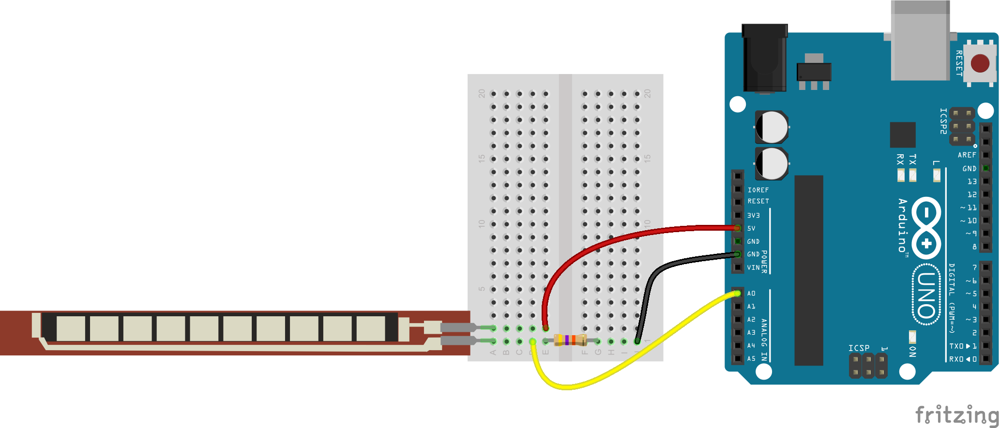

# **IoT Project - SMART GLOVES**

## **Table of Contents**

| **Sl No** | **Title**               |
|-----------|-------------------------|
| 1         | [Project Title](#project-title)            |
| 2         | [About the Project](#about-the-project)        |
| 3         | [Circuit Diagram](#circuit-diagram)          |
| 4         | [Source Code](#source-code)              |
| 5         | [List of Components](#list-of-components)       |
| 6         | [Setup and Installation](#setup-and-installation)   |
| 7         | [Debugging](#debugging)                |

## **About the Project**

This project is designed to assist individuals with speech disabilities in communicating essential messages using flex sensors. The system involves 5 flex sensors attached to each hand, which are connected to an Arduino Nano. When the sensors are bent, specific messages such as "give me water," "give me food," or "I need help" are played through a loudspeaker. The sounds are stored on an SD card and played using a DFmini module.

## **Circuit Diagram**

 

## **Source Code**

The source code for the project can be found in folder or downloaded from the following link : [SOURCE CODE](https://drive.google.com/uc?export=download&id=13b_jAJNtJDgeBUJKpzmETdV6VbZlZKHs)

 

## **List of Components**

| **Sl No** | **Name**             | **Image** | **Quantity** | **Price** |
|-----------|----------------------|-----------|--------------|-----------|
| 1         | Flex Sensors          | | 5           | ₹___      |
| 2         | Arduino Nano          |  | 1            | ₹___      |
| 3         | DFmini MP3 Player     |  | 1            | ₹___      |
| 4         | SD Card               |  | 1            | ₹___      |
| 5         | Loudspeaker           |  | 1            | ₹___      |

*Note: The prices mentioned above are sourced from Amazon. It is advisable to purchase from a wholesale electronics dealer. We bought our components from SP Road Bangalore, Vishal Electronics.*  
**Location map**: [Vishal Electronics, SP Road Bangalore](https://maps.app.goo.gl/qmP8eU92v7zgoXFd9)

## **Setup and Installation**

1. **Assembling the Circuit**: Begin by connecting the flex sensors, Arduino Nano, DFmini, SD card, and loudspeaker as per the circuit diagram.
2. **Configuring Arduino IDE**: 
   - Open the Arduino IDE.
   - Connect your Arduino Nano to your computer via USB.
   - Go to **Tools > Board > Arduino Nano**.
   - Select the correct port under **Tools > Port**.
3. **Uploading the Code**: 
   - Open the `source.ino` file in Arduino IDE.
   - Click on **Upload** to upload the code to the Arduino Nano.
4. **Testing**: Once uploaded, you can test the system by bending the flex sensors to trigger the appropriate messages.

## **Debugging**

### **DFmini Player and Loudspeaker Debugging**

  

Code for DFmini and Loudspeaker can be found in the above folder or downloaded here : [FLEX](https://drive.google.com/uc?export=download&id=13b_jAJNtJDgeBUJKpzmETdV6VbZlZKHs)

### Steps for Debugging:

### 1) Isolate DFmini and Loudspeaker
- Disconnect all other sensors and components, leaving only the DFmini player and the loudspeaker connected to the Arduino Nano.

### 2) Prepare the SD Card
- **Format the SD Card**: Format the SD card to FAT32.
- **Add Audio Files**: Copy your audio files to the root directory of the SD card. Ensure they are in MP3 format and not stored in any folders. The filenames can be anything, such as `song1.mp3`, `alert.mp3`, etc.
- **Insert the SD Card**: Insert the SD card into the DFmini player module.

### 3) Upload Test Code
- **Adjust the Code**: Use the DFmini player test code. Ensure you set the correct RX and TX pins in the code based on your wiring diagram. The code should include a command like `mp3.playTrackNumber(1, 30);` to play the first track with a volume level of 30.
- **Upload the Code**: Upload the code to the Arduino Nano.

### 4) Check Responses
- **DFmini Player**: Ensure the DFmini is correctly reading the SD card and sending audio data to the loudspeaker. The selected audio file should play through the loudspeaker.
- **Loudspeaker**: If the loudspeaker is not producing sound, check the connections and try adjusting the volume or testing with a different audio file.

---

### **Flex Sensor and Arduino Debugging**

 

Code for Flex sensor can be found in the above folder or downloaded here : [FLEX](https://drive.google.com/uc?export=download&id=13b_jAJNtJDgeBUJKpzmETdV6VbZlZKHs)

### Steps for Debugging:

### 1) Isolate Flex Sensor and Arduino
- Disconnect all other components, leaving only the flex sensor connected to the A0 pin of the Arduino Nano.

### 2) Prepare the Flex Sensor
- **Check the Connection**: Ensure that one end of the flex sensor is connected to the A0 pin of the Arduino Nano, and the other end is connected to ground (GND) through a resistor.
- **Verify the Wiring**: Double-check the wiring for any loose connections or incorrect placements.

### 3) Upload Test Code
- **Adjust the Code**: Modify the test code to read the analog input from the A0 pin. The code should include a command like `int flexValue = analogRead(A0);` to read the value from the flex sensor.
- **Upload the Code**: Upload the code to the Arduino Nano.

### 4) Check Responses
- **Flex Sensor Reading**: Monitor the serial output to ensure the Arduino is correctly reading the flex sensor's values. The values should change as you bend the sensor.
- **Troubleshoot**: If the sensor is not providing expected readings, check the connections, try a different sensor, or adjust the resistor value.

